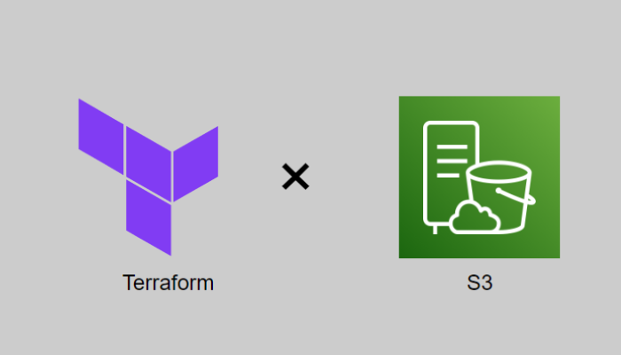
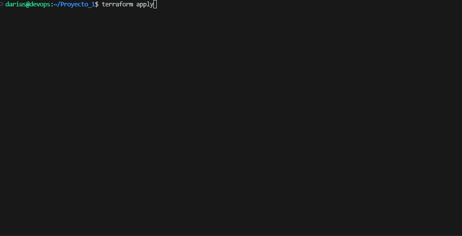
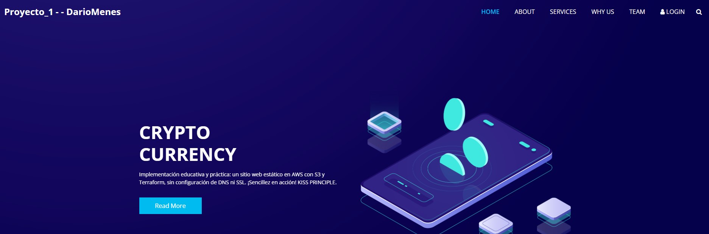

# Proyecto_1 - - DarioMenes

- Este proyecto demuestra la simplicidad de crear un sitio web estático y hospedarlo en un bucket S3 de AWS sin la necesidad de utilizar servicios de DNS como R-53 ni certificados SSL. 
- La implementación se destaca por su eficiencia y claridad, con tan solo 95 líneas de código en el archivo main.tf de Terraform. 
- La clave radica en la creación de una política específica que se adjunta al bucket, concediendo permisos de lectura únicamente a los usuarios autorizados. 
- Esta Infrastructure as Code (IaC) no solo simplifica el proceso, sino que también destaca la facilidad con la que se pueden configurar recursos esenciales para la creación de un sitio web estático en AWS con estas lineas de codigo.

- Aprendiendo haciendo y deshaciendo...
# Running

- Recordar el tfvars y variables de entorno
- terraform init, plan, apply and destroy

# Output final

